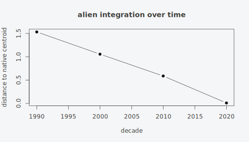
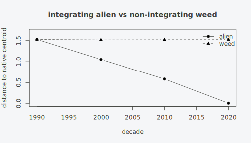

# Alien integration trajectories

A neophyte arrives in disturbed ground with a ruderal flora and, over
decades, may settle into the resident native community.
[`integration_trajectory()`](https://gcol33.github.io/specvec/reference/integration_trajectory.md)
measures that settling: it tracks the focal species’ distance to the
native-community centroid through time, in one fixed embedding frame. A
falling distance is integration. The neophyte’s associates shift from
where it arrived toward the native community.

``` r

library(specvec)
```

## What integration means here

A recently established alien plant rarely starts inside the community it
will eventually join. It first appears in the company it can colonise:
roadsides, fallows, recently disturbed soil, the ruderal pool. If it
persists and spreads, its plot-level neighbours change. The same taxon
that shared ground with thistles and pioneer grasses in 1990 shares
ground with woodland or grassland natives by 2020. Integration is that
change of company, read off the species the neophyte co-occurs with, a
community-level signal that no single trait carries.

specvec turns “the company a species keeps” into a coordinate. Two
species that repeatedly share cover-heavy plots land near each other,
two that never meet land far apart (the geometry is laid out in
[`vignette("specvec-quickstart")`](https://gcol33.github.io/specvec/articles/specvec-quickstart.md)).
A neophyte that moves from ruderal company to native company therefore
moves through that coordinate space, and the distance from where it sits
to the centre of the native community is a number we can follow decade
by decade. When the number falls, the neophyte’s neighbourhood has
shifted toward the natives. When it stays high, the neophyte has stayed
in the flora it arrived with.

The measurement rests on three pieces, and the value of
[`integration_trajectory()`](https://gcol33.github.io/specvec/reference/integration_trajectory.md)
is that it wires them together in a single coordinate system so the
per-decade positions are directly comparable.

- The **frame** is one species embedding, fitted once on the resident
  species pool. It is the fixed coordinate system every later reading is
  expressed in.
- The **focal placement** puts the neophyte, per time window, at the
  cover-weighted centroid of the frame species it co-occurs with in that
  window. This is exactly the
  [`species_trajectory()`](https://gcol33.github.io/specvec/reference/species_trajectory.md)
  projection.
- The **native centroid** puts the native community, per window, at the
  centroid of its pooled plot embeddings in the same frame. This is the
  [`community_embedding()`](https://gcol33.github.io/specvec/reference/community_embedding.md)
  readout, restricted to native species.

The trajectory is the distance between the focal placement and the
native centroid in each window.

## Why one fixed frame

The naive way to track a species over time is to embed each decade on
its own and compare the coordinate matrices. That fails for a numerical
reason laid out in full in
[`vignette("specvec-temporal")`](https://gcol33.github.io/specvec/articles/specvec-temporal.md):
separate fits produce separate bases, so a species sitting at the same
numbers in two decades has not necessarily stayed put. The two
coordinate pairs are written in different languages, and Procrustes
rotation only rescues the comparison when the species pool barely turned
over, which is exactly the case where nothing interesting happened.

[`integration_trajectory()`](https://gcol33.github.io/specvec/reference/integration_trajectory.md)
sidesteps this by fitting the frame once and reading every window out in
it. The frame never moves, so there is nothing to align. A neophyte’s
position in 1990 and its position in 2020 are coordinates in the same
basis, and their difference is a genuine displacement. The native
centroid is read in that same frame, so the focal-to-native distance
lives in one space across all the decades. There is no per-window
rotation and no circularity, because the focal species never contributes
to the axes that define the frame.

## A simulated invasion

We need data where the answer is known, so the method has something to
recover. The simulation holds a native community as a stable backbone in
every decade, runs a ruderal flora alongside it, and lets a focal
`"alien"` ride the ruderal pool early and the native pool late. A second
focal species, `"weed"`, stays in the ruderal pool throughout and never
drifts. The `weed` is the control: a species that arrives and persists
without integrating, so the method should report a falling distance for
the `alien` and a flat one for the `weed`.

``` r

sim_invasion <- function(seed = 1) {
  set.seed(seed)
  native  <- paste0("nat", 1:8)
  ruderal <- paste0("rud", 1:8)
  decades <- c(1990, 2000, 2010, 2020)
  rows <- list(); pid <- 0L
  for (d in seq_along(decades)) {
    share <- (d - 1) / (length(decades) - 1)   # the alien's pull toward natives
    for (i in 1:120) {                          # plots carrying the integrating alien
      pid <- pid + 1L
      pool <- if (runif(1) < share) native else ruderal
      sp <- c(sample(pool, sample(3:6, 1)), "alien")
      rows[[pid]] <- data.frame(plot = paste0("p", pid), species = sp,
                                cover = round(runif(length(sp), 5, 90), 1),
                                decade = decades[d])
    }
    for (i in 1:120) {                          # plots carrying the non-integrating weed
      pid <- pid + 1L
      sp <- c(sample(ruderal, sample(3:6, 1)), "weed")
      rows[[pid]] <- data.frame(plot = paste0("p", pid), species = sp,
                                cover = round(runif(length(sp), 5, 90), 1),
                                decade = decades[d])
    }
    for (i in 1:60) {                           # resident native backbone
      pid <- pid + 1L
      sp <- sample(native, sample(3:6, 1))
      rows[[pid]] <- data.frame(plot = paste0("p", pid), species = sp,
                                cover = round(runif(length(sp), 5, 90), 1),
                                decade = decades[d])
    }
  }
  do.call(rbind, rows)
}

df <- sim_invasion()
x  <- specvec(df, "plot", "species", abundance = "cover", time = "decade")
x
#> <specvec_data> plots=1200  species=18
#>   presence: nnz=6300  density=29.1667%
#>   abundance: yes (cover_scale=percent)  duplicates=max
#>   time: 4 distinct value(s), range 1990-2020
```

Three groups of plots feed each decade. The 120 alien-bearing plots draw
their companions from the ruderal pool with probability `1 - share` and
from the native pool with probability `share`, so `share` climbs from 0
in 1990 to 1 in 2020 and the alien’s company turns over from ruderal to
native. The 120 weed-bearing plots always draw from the ruderal pool, so
the weed’s company never changes. The 60 native-only plots anchor the
native species in every decade, which keeps the native pole stable
through time and makes a sensible target for the centroid.

The known truth is therefore concrete: the alien’s distance to the
native centroid should fall steadily across the four decades, and the
weed’s should stay roughly where it started.

## Running the trajectory

We trace the integrating alien against the eight native species. The
`native` argument names the community whose centroid is the target. We
leave `frame` at its default, so the frame is fitted on every species
except the focal one, which keeps the ruderal pole in the coordinate
system.

``` r

natives <- paste0("nat", 1:8)
it <- integration_trajectory(x, species = "alien", native = natives,
                             dim = 16, min_occurrence = 3)
it
#> <specvec_integration> focal=1  windows=4  dim=16  metric=euclidean  weights=cover
#>   frame: method=abund_pmi  species=17  native=8
#>   alien -> native centroid:
#>     window        n_plots  support    euclidean
#>     1990              300      120       1.5315
#>     2000              300      120       1.0557
#>     2010              300      120       0.5875
#>     2020              300      120       0.0107
```

The print reports the frame (here the 17 non-focal species, embedded
once), the metric, the pooling weight, and one block per focal species.
Each block lists, per window, the plots in the window (`n_plots`), the
focal-bearing plots (`support`), and the focal-to-native distance. The
distance falls decade by decade as the alien’s co-occurrents shift into
the native community.

``` r

d <- as.data.frame(it)
plot(d$center, d$distance, type = "b", pch = 19,
     xlab = "decade", ylab = "distance to native centroid",
     main = "alien integration over time")
```



## Reading the support columns

[`as.data.frame()`](https://rdrr.io/r/base/as.data.frame.html) tidies
the integration object into one row per focal-species-by-window cell,
and the columns say exactly how much data backs each distance.

``` r

as.data.frame(it)
#>   species window center n_plots support native_support   distance
#> 1   alien   1990   1990     300     120             60 1.53150716
#> 2   alien   2000   2000     300     120             97 1.05565463
#> 3   alien   2010   2010     300     120            134 0.58752691
#> 4   alien   2020   2020     300     120            180 0.01065574
```

`support` is the number of plots in the window that carry the focal
species; it sets how well the focal placement is estimated.
`native_support` is the number of plots in the window that carry at
least one native species; it sets how well the native centroid is
estimated. In this simulation `support` holds at 120 for the alien in
every decade, so the placement is well backed throughout, while
`native_support` climbs from 60 to 180 as more of the alien-bearing
plots take on native species. Both numbers matter when reading a real
trajectory: a cell can have ample focal support and still rest on a thin
native centroid, or vice versa.

A cell carries `NA` in two situations. The distance is `NA` when the
focal species co-occurs with no frame species in the window, so its
placement is undefined, and also when the window holds no native-bearing
plots, so the centroid is undefined. Passing `na.rm = TRUE` to
[`as.data.frame()`](https://rdrr.io/r/base/as.data.frame.html) drops
those rows.

## Frame and native are two different sets

[`integration_trajectory()`](https://gcol33.github.io/specvec/reference/integration_trajectory.md)
keeps the coordinate system separate from the target, and the separation
is the design point that makes an early position well defined.

- `frame` defaults to every species except the focal one. Keeping the
  whole resident pool in the frame, including the ruderal pole, is what
  gives the neophyte somewhere to sit when it first arrives. The alien
  starts among the flora it came with, and its motion toward the natives
  is a real displacement across the space.
- `native` is the subset whose centroid is the target. It defaults to
  the whole frame, but for a real measurement we name the native
  species, so the distance is measured against the community we care
  about rather than against the resident pool at large.

To see why the frame has to be the broad pool, we can fit it on the
native subset alone and watch the early window break.

``` r

it_nat <- integration_trajectory(x, species = "alien", frame = natives,
                                 native = natives, dim = 16, min_occurrence = 3)
as.data.frame(it_nat)[, c("window", "support", "native_support", "distance")]
#>   window support native_support   distance
#> 1   1990     120             60         NA
#> 2   2000     120             97 0.01883309
#> 3   2010     120            134 0.01336752
#> 4   2020     120            180 0.01065574
```

The 1990 distance is now `NA`. With only the eight native species in the
frame and an alien that lived entirely in the ruderal pool that decade,
the alien co-occurs with no frame species at all, so it has no centroid
to sit at and no distance to report. The later distances collapse to
near zero, because once the frame is the native species and the target
is the native species, every alien placement is pulled onto the native
cloud by construction and the measurement loses its meaning. The broad
frame is what represents the pole the neophyte arrives from, so the
early position exists and the displacement toward the natives is
something the geometry can actually carry.

## A non-integrating control

The falling distance is only useful if it falls when integration happens
and stays flat when it does not. The simulation already contains the
test: the `weed` is a species that arrives, persists, and never leaves
the ruderal pool. Tracing both focal species at once puts them in the
same frame and the same windows.

``` r

itb <- integration_trajectory(x, species = c("alien", "weed"), native = natives,
                              dim = 16, min_occurrence = 3)
db <- as.data.frame(itb)
db[, c("species", "window", "distance")]
#>   species window   distance
#> 1   alien   1990 1.52612732
#> 2   alien   2000 1.05193051
#> 3   alien   2010 0.58541840
#> 4   alien   2020 0.01065574
#> 5    weed   1990 1.52606747
#> 6    weed   2000 1.51676213
#> 7    weed   2010 1.52063010
#> 8    weed   2020 1.52244577
```

The alien’s distance drops from roughly 1.5 to near zero, while the
weed’s stays near 1.5 in every decade. The weed never changes the
company it keeps, so it never moves toward the native centroid, and the
method reports no integration. Plotting the two curves together shows
the specificity directly.

``` r

da <- db[db$species == "alien", ]
dw <- db[db$species == "weed", ]
plot(da$center, da$distance, type = "b", pch = 19, ylim = c(0, 1.7),
     xlab = "decade", ylab = "distance to native centroid",
     main = "integrating alien vs non-integrating weed")
lines(dw$center, dw$distance, type = "b", pch = 17, lty = 2)
legend("topright", c("alien", "weed"), pch = c(19, 17), lty = c(1, 2), bty = "n")
```



The contrast is the model comparison that the applied question needs. A
single falling curve says a species integrated; the flat control curve
says the falling curve is specific to integration rather than an
artefact that every persistent neophyte would produce.

## Euclidean and cosine distance

The `metric` argument chooses how the focal-to-native distance is
measured. `"euclidean"` (the default) is the straight-line distance in
the frame, so it reflects absolute displacement: a species that moves a
long way through the coordinate space registers a large drop. `"cosine"`
is returned as one minus the cosine similarity, so a smaller value still
means closer, but it measures the angle between the focal vector and the
native centroid rather than the gap between them. Cosine reads the
direction of the company a species keeps and ignores the length of its
vector.

``` r

it_euc <- integration_trajectory(x, species = "alien", native = natives,
                                 dim = 16, min_occurrence = 3, metric = "euclidean")
it_cos <- integration_trajectory(x, species = "alien", native = natives,
                                 dim = 16, min_occurrence = 3, metric = "cosine")
data.frame(decade   = as.data.frame(it_euc)$center,
           euclidean = round(as.data.frame(it_euc)$distance, 3),
           cosine    = round(as.data.frame(it_cos)$distance, 3))
#>   decade euclidean cosine
#> 1   1990     1.532  1.000
#> 2   2000     1.056  0.545
#> 3   2010     0.588  0.121
#> 4   2020     0.011  0.000
```

Both metrics fall across the decades, so the integration signal survives
either choice. They differ in what they are sensitive to. Euclidean
distance moves when the magnitude of the focal placement changes, which
can happen when a species’ total co-occurrence grows or shrinks even if
the mix of associates is steady. Cosine distance moves only when the
proportional mix of associates changes, so it isolates the compositional
shift. Cosine is the safer reading when the focal species’ overall
frequency changes a lot across windows, because a length-insensitive
measure will not confuse “more records” with “different company”.
Euclidean is the more direct reading when absolute position in the frame
is the quantity of interest.

## Robustness across seeds

A single simulated dataset is one draw. To check that the integration
signal is a property of the construction rather than of one random seed,
we re-simulate over several seeds and collect the net drop in distance,
from the first window to the last, for each. We keep `dim` small so each
fit is quick.

``` r

net_drop <- function(seed) {
  xs <- specvec(sim_invasion(seed), "plot", "species",
                abundance = "cover", time = "decade")
  dd <- as.data.frame(integration_trajectory(xs, species = "alien",
        native = paste0("nat", 1:8), dim = 8, min_occurrence = 3))
  dd <- dd[order(dd$center), ]
  dd$distance[1] - dd$distance[nrow(dd)]
}
drops <- vapply(1:4, net_drop, numeric(1))
round(drops, 3)
#> [1] 1.521 1.505 1.518 1.497
sprintf("net drop: mean %.3f, sd %.3f", mean(drops), sd(drops))
#> [1] "net drop: mean 1.510, sd 0.011"
```

The net drop is large and consistent across the four seeds, with a small
spread. The standard deviation across seeds is the uncertainty estimate
for the integration signal: a wide spread would mean the falling
distance depends on the particular draw, and a tight spread, as here,
means the construction reliably produces it. On real data the same idea
applies to robustness checks such as re-fitting at a few embedding
dimensions or sub-sampling the plots; a signal that survives those
perturbations is one worth reporting.

## Where the measurement gets thin

The trajectory is only as trustworthy as the cells that back it, and
three thin spots deserve attention.

Sparse windows produce `NA` cells. A focal species that appears in a
window but shares no plot with any frame species has no centroid, and
the distance is `NA` rather than zero. The same is true of a window with
no native-bearing plots: the native centroid is undefined and every
focal distance in that window is `NA`. These are honest gaps, and
`na.rm = TRUE` drops them, but a trajectory peppered with `NA` cells is
a sign the windows are cut too finely for the data.

Low `native_support` lets the centroid swing. The native centroid is an
average over the native-bearing plots in a window, so a window with a
handful of such plots gives a centroid that moves on individual records.
A falling distance built on a native centroid estimated from five plots
is far weaker evidence than the same drop against a centroid from a
hundred.

Thin focal `support` makes the placement noisy. The focal species is
placed at the cover-weighted centroid of the plots that carry it, so a
window where the species occurs in two plots gives a noisier position
than one where it occurs in eighty. The placement is still defined, so
the cell carries a value, and its position should be read with the
support count in view. The `$support` and `$native_support` fields on
the integration object, surfaced as the `support` and `native_support`
columns of the tidy form, report both counts for exactly this purpose.

## Anchor on resampled plots

Across decades, raw plot data confounds integration with where and what
was sampled each decade. A shift in the distance could be a shift in the
survey rather than in the species: if the 2020 plots simply sit in more
native-rich habitat than the 1990 plots, the alien will look like it
integrated even if its real company never changed. The cure is to follow
the same locations through time. Restrict the data to resampled
(ReSurvey) plots before building the `specvec` object, so each decade
re-measures ground that was measured before.

[`integration_trajectory()`](https://gcol33.github.io/specvec/reference/integration_trajectory.md)
takes whatever plots it is given and does not hard-code a survey-design
column. The restriction is a data-preparation step the caller applies:
filter the records down to the resampled plots first, then build the
`specvec_data` from the filtered table. The function then sees only the
anchored plots, so the trajectory it reads is a within-location change
at fixed sites.

## On your own data

A European Vegetation Archive (EVA) export carries the columns this
needs: a plot id, a taxon, a cover value, a decade, a native or neophyte
status, and a ReSurvey flag. The native set comes from the status
column, and the ReSurvey flag selects the resampled plots. The block
below sketches the path on real exports; it does not run here because it
reads external files.

``` r

library(data.table)
sp <- fread("species_export.csv")
hd <- fread("header_export.csv")                 # plot-level: decade, ReSurvey flag

resurvey <- hd[`ReSurvey plot (Y/N)` == "Y", PlotObservationID]
sp <- sp[PlotObservationID %in% resurvey]        # follow the same locations

x <- specvec(sp, plot = "PlotObservationID", species = "taxon",
             abundance = "cover", time = "Decade")

natives <- unique(sp[STATUS == "native", taxon])
integration_trajectory(x, species = "Robinia pseudoacacia",
                       native = natives, min_occurrence = 5)
```

The `STATUS` column drives the native set, the `ReSurvey plot (Y/N)`
flag selects the plots that were revisited, and the `Decade` column
supplies the time axis. EVA is an access-controlled database, available
on request rather than as an open download, and specvec bundles none of
it; the trajectory is meant to run on an export you already have access
to.

## Practical guidance

A few rules of thumb keep an integration reading honest.

**Read the support before trusting a cell.** Treat a focal `support`
below about ten plots, or a `native_support` below about ten, as weak
evidence for that window’s distance. Both counts are in the tidy form
for exactly this check, and a clean falling curve built on single-digit
support is closer to noise than to signal.

**Set the embedding dimension by size.** A `dim` of 8 to 16 is plenty
for a few hundred to a few thousand plots and keeps each fit fast.
Larger continental datasets carry more independent structure, so 32 to
64 is sensible there. The integration signal is stable across this
range, so dimension is a speed-versus-resolution dial rather than a knob
that flips the answer.

**Choose cover or presence deliberately.** With `weights = "cover"` (the
default when cover is present) co-occurrence and pooling are weighted by
the geometric mean of covers, so abundant associates pull the placement
harder. With `weights = "presence"` every co-occurring plot counts the
same. Cover is the sharper signal when the abundance is meaningful, and
presence is the safer choice when covers are ordinal guesses or missing.

**Name the native set to the question.** The default native set is the
whole frame, which measures distance to the resident community at large.
A real integration question wants a deliberate native set: the species
native at the study region, or a habitat-specific native pool if the
question is integration into one community rather than into the regional
flora. A native set that is too broad spreads the centroid across
unrelated habitats and dilutes the signal.

**Prefer cosine when frequency swings.** Use Euclidean distance when
absolute position in the frame is the quantity of interest, and cosine
distance when the focal species’ overall frequency changes a lot across
windows, because the length-insensitive measure isolates the
compositional shift from the change in record count.

**Check a handful of seeds or perturbations.** Three or four re-fits,
whether across simulation seeds, embedding dimensions, or plot
sub-samples, are enough to report a mean net drop with a spread. A
signal that holds across them is reportable; one that depends on a
single fit is not.

**When not to read a falling distance as integration.** A drop is not
integration when the survey shifted under it, which is why anchoring on
resampled plots comes first. It is also not integration when the native
set is so broad that the centroid sits in the middle of everything, so
any species that gains records appears to approach it. And a drop
carried by one or two windows with thin support is a draw of the dice.
The construction reports motion through the company a species keeps;
reading that as ecological integration is sound only when the plots, the
native set, and the support all hold up.
